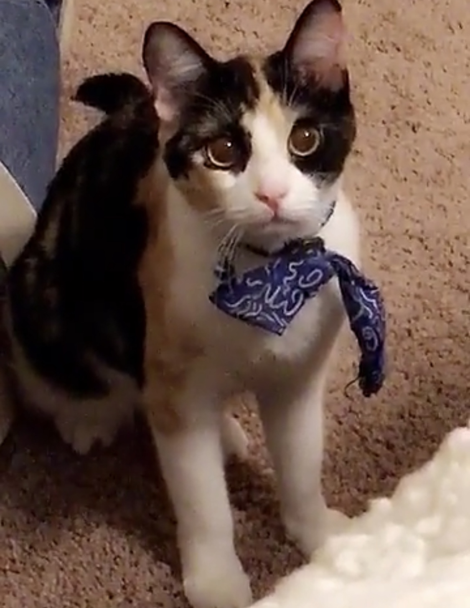
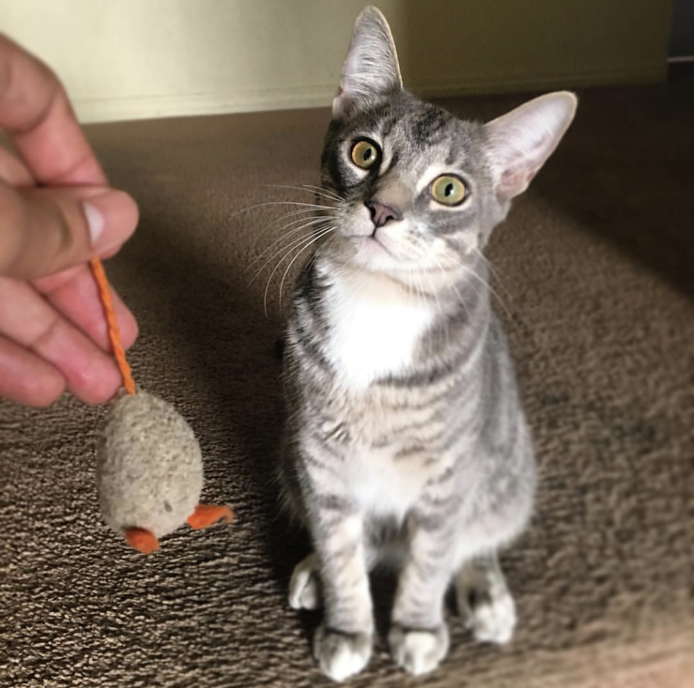

# fine_tuning_VGG16
Building a Classifier: Fine tuning VGG16 in Keras 

This work is largely based on the tutorial by Francois Chollet (many thanks!):
[Building powerful image classification models using very little data](https://blog.keras.io/building-powerful-image-classification-models-using-very-little-data.html)

Citation for VGG16 Model used:

Very Deep Convolutional Networks for Large-Scale Image Recognition.
K. Simonyan, A. Zisserman.
arXiv:1409.1556

### Objective: Build a classifier & improve performance with fine-tuning

### The challenge of limited data
One of the biggest challenges in applying deep learning to real-world problems is that it can be very difficult or expensive to obtain enough training data (think high-quality medical images, or large amounts of language data). It is a good practice to learn how to make the most of little data. Additionally, it's good to know how to leverage existing work and use pre-trained models to save time and computational resources. 

So far in my machine learning journey, I've worked primarily with established open datasets in computer vision (e.g. MNIST, CIFAR-10, Imagenet, Fashion MNIST). In reality, a large part of deep learning practitioner's time is spent on collecting & cleaning the datasets themselves; so I wanted to use this tutorial to practice curating my own dataset, and practice fine-tuning a model for classification

### Classifying Calico vs Tabby cats
As my first fine-tuning problem, I was inspired to build an image classifier to identify my brother's cat (tabby) vs. my sister's cat (calico).

*My sister's calico cat:*

*My brother's tabby cat:*

### Method
Generally, this is the method I followed:

1. Create the dataset
2. Clean data & separate to train and validation sets
3. Data Augmentation
4. Build & train a custom classifier
5. Fine-tune VGG16

#### 1. Create the dataset

[WIP]
