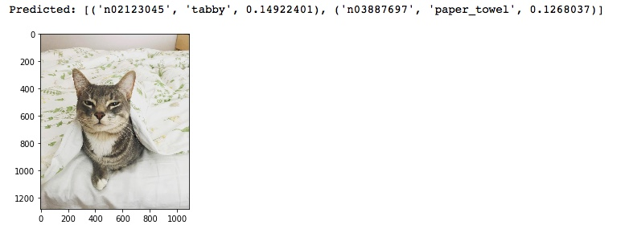
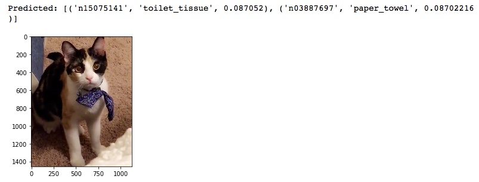
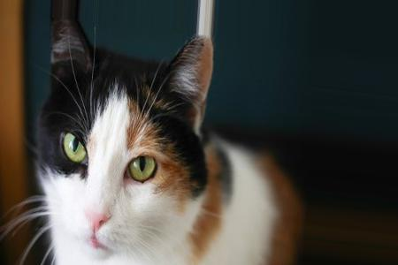
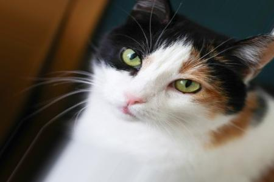
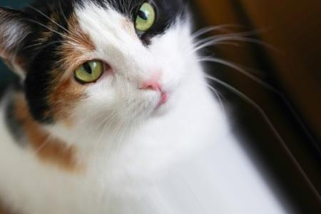
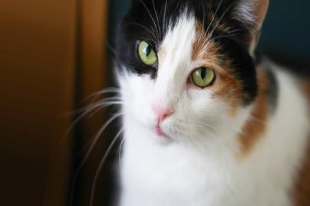
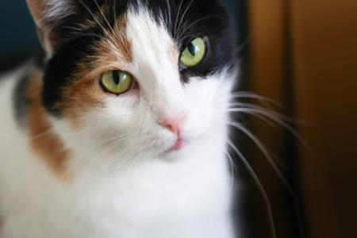
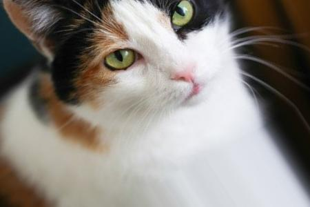

# fine_tuning_VGG16
Building a Classifier: Fine tuning VGG16 in Keras 

This work is largely based on the tutorial by Francois Chollet (many thanks!):\
[Building powerful image classification models using very little data](https://blog.keras.io/building-powerful-image-classification-models-using-very-little-data.html)

Citation for VGG16 Model used:\
Very Deep Convolutional Networks for Large-Scale Image Recognition.
K. Simonyan, A. Zisserman.
arXiv:1409.1556

### Objective: Build a classifier & improve performance with fine-tuning

### The challenge of limited data
One of the biggest challenges in applying deep learning to real-world problems is that it can be very difficult or expensive to obtain enough training data (think high-quality medical images, or large amounts of language data). It is a good practice to learn how to make the most of little data. Additionally, it's good to know how to leverage existing work and use pre-trained models to save time and computational resources. 

So far in my machine learning journey, I've worked primarily with established open datasets in computer vision (e.g. MNIST, CIFAR-10, Imagenet, Fashion MNIST). But in reality, a large part of a deep learning practitioner's time is spent on collecting & cleaning the datasets themselves; so I wanted to use this tutorial to practice curating my own dataset, and practice fine-tuning a model for classification.

### Classifying Calico vs Tabby cats
As my first fine-tuning problem, I was inspired to build an image classifier to identify my brother's cat (tabby) vs. my sister's cat (calico). My motivation: when using the [Keras out of the box VGG16 model](https://keras.io/applications/#extract-features-with-vgg16) trained on imagenet to make predictions, the calico cat seems to always be mis-classified. 

My idea was, could I fine-tune a pre-trained VGG16 model using my own dataset of calico and tabby pictures, to improve the classification of the calicos? 

*My brother's tabby cat, top 2 predictions:*

*My sister's calico cat, top 2 predictions:*

### Method
This the method I followed:

1. Download images of calicos & tabbies to create the dataset
2. Prune data & separate to train and validation sets
3. Data Augmentation
4. Build & train a custom classifier
5. Fine-tune VGG16, compare performance to custom classifier

#### 1. Download images of calicos & tabbies to create the dataset
My first challenge was to obtain the images for my dataset. You may be surprised, but I don't happen to have hundreds of images of my sibling's cats just lying around :smile: I used the [Flickr API](https://www.flickr.com/services/api/) to collect 2600 images of calico and tabby cats. Many thanks to [this tutorial](https://towardsdatascience.com/how-to-use-flickr-api-to-collect-data-for-deep-learning-experiments-209b55a09628) from Towards Data Science for the guidance.

It was important to: 1) be explicit in the search query in order to get relevant images 2) get at least a thousand images per class 

#### 2. Prune data & separate to train and validation sets

In the end I collected roughly 1500 images per class (~3000 images total). Then, I manually went through the full dataset to remove obvious false positives or irrelevant files that were collected. This brought me down to ~1300 images per class (2600 images total). I then allocated 1000 images for train and 300 images for validation per class, and saved into folders in the below structure:

train/\
&nbsp;&nbsp;calico/\
&nbsp;&nbsp;&nbsp;calico1.jpg\
&nbsp;&nbsp;&nbsp;calico2.jpg\
&nbsp;&nbsp;&nbsp;...\
&nbsp;&nbsp;tabby/\
&nbsp;&nbsp;&nbsp;tabby1.jpg\
&nbsp;&nbsp;&nbsp;tabby2.jpg\
&nbsp;&nbsp;&nbsp;...\
validation/\
&nbsp;&nbsp;calico/\
&nbsp;&nbsp;&nbsp;calico1.jpg\
&nbsp;&nbsp;&nbsp;calico2.jpg\
&nbsp;&nbsp;&nbsp;...\
&nbsp;&nbsp;tabby/\
&nbsp;&nbsp;&nbsp;tabby1.jpg\
&nbsp;&nbsp;&nbsp;tabby2.jpg\
&nbsp;&nbsp;&nbsp;...

#### 3. Data Augmentation 

*See fine_tuning_VGG16_pt1.py*

1000 images is not that much data, so I followed a data augmentation and pre-processing strategy to try and reduce overfitting (Small datasets are prone to overfitting on the training set, especially when the dataset is much smaller than the number of parameters in your model).

The data augmentation allows us to grow our dataset by generating synthetic images via a number of transformations: rotating the image in various degrees, vertical/horizontal flips, rescaling, shear transformations, random zooms, etc.

below is an example of a few images with data augmentation:

  
   
  

  
   
  

#### 4. Build & train a custom classifier

*See fine_tuning_VGG16_pt1.py*

#### 5. Fine-tune VGG16, compare performance to custom classifier

*See fine_tuning_VGG16_pt3.py*

#### 6. Limitations
Although the validation accuracy is still not to the level I would hope on the fine-tuned model (we’re still below 80%), it did improve from the custom CNN. Moreover, the prediction probability for the calico class increased. So we’re moving the needle in the right direction.

We clearly have an issue with overfitting the training data; I also suspect that I might have an issue with the dataset itself (irrelevant data, not enough validation examples, etc). 

Some debug steps I need to explore to improve the performance:

* Increase the number of validation images
* More aggressive data augmentation
* Add regularization to further tackle overfitting

[WIP]
