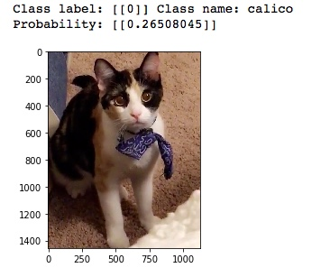
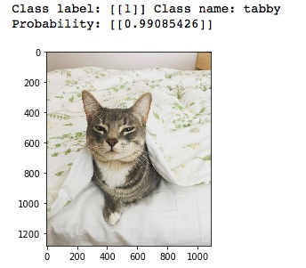
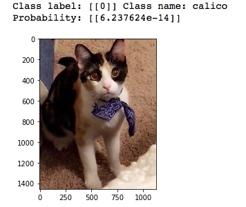
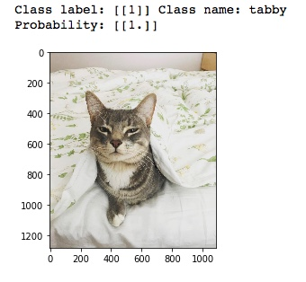

# fine_tuning_VGG16
Building a Classifier: Fine tuning VGG16 in Keras 

This work is an implementation (for learning purposes) of the following tutorial by Francois Chollet (many thanks!):\
[Building powerful image classification models using very little data](https://blog.keras.io/building-powerful-image-classification-models-using-very-little-data.html)

Citation for VGG16 Model used:\
Very Deep Convolutional Networks for Large-Scale Image Recognition.
K. Simonyan, A. Zisserman.
arXiv:1409.1556

### Objective: Build a classifier & improve performance with fine-tuning

### The challenge of limited data
One of the biggest challenges in applying deep learning to real-world problems is that it can be very difficult or expensive to obtain enough training data (think high-quality medical images, or large amounts of language data). It is a good practice to learn how to make the most of little data. Additionally, it's good to know how to leverage existing work and use pre-trained models to save time and computational resources. 

So far in my machine learning journey, I've worked primarily with established open datasets in computer vision (e.g. MNIST, CIFAR-10, Imagenet, Fashion MNIST). But in reality, a large part of a deep learning practitioner's time is spent on collecting & cleaning the datasets themselves; so I wanted to use this tutorial to practice curating my own dataset, and practice fine-tuning a model for classification.

### Classifying Calico vs Tabby cats
As my first fine-tuning problem, I was inspired to build an image classifier to identify my brother's tabby cat vs. my sister's calico cat. My motivation: when using the [Keras VGG16 model](https://keras.io/applications/#extract-features-with-vgg16) trained on Imagenet to make predictions, the calico cat seems to always be mis-classified. 

*My brother's tabby cat, top 2 predictions:*


*My sister's calico cat, top 2 predictions:*


My idea was, could I fine-tune a pre-trained VGG16 model using my own dataset of calico and tabby pictures, to improve the classification of the calicos? 


### Method
This the method I followed:

1. Download images of calicos & tabbies to create the dataset
2. Prune data & separate to train and validation sets
3. Perform data augmentation
4. Build & train a custom classifier
5. Fine-tune VGG16, compare performance to custom classifier

#### 1. Download images of calicos & tabbies to create the dataset
My first challenge was to obtain the images for my dataset. You may be surprised, but I don't happen to have hundreds of images of my sibling's cats just lying around :smile: I used the [Flickr API](https://www.flickr.com/services/api/) to collect ~3000 images of calico and tabby cats. Many thanks to [this tutorial](https://towardsdatascience.com/how-to-use-flickr-api-to-collect-data-for-deep-learning-experiments-209b55a09628) from Towards Data Science for the guidance.

It was important to: 1) be explicit in the search query in order to get relevant images 2) get at least a thousand images per class 

#### 2. Prune data & separate to train and validation sets

In the end I collected roughly 1500 images per class (~3000 images total). Then, I manually went through the full dataset to remove obvious false positives or irrelevant files that were collected. This brought me down to ~1300 images per class (2600 images total). I then allocated 1000 images for train and 300 images for validation per class, and saved into folders in the below structure:

train/\
&nbsp;&nbsp;calico/\
&nbsp;&nbsp;&nbsp;calico1.jpg\
&nbsp;&nbsp;&nbsp;calico2.jpg\
&nbsp;&nbsp;&nbsp;...\
&nbsp;&nbsp;tabby/\
&nbsp;&nbsp;&nbsp;tabby1.jpg\
&nbsp;&nbsp;&nbsp;tabby2.jpg\
&nbsp;&nbsp;&nbsp;...\
validation/\
&nbsp;&nbsp;calico/\
&nbsp;&nbsp;&nbsp;calico1.jpg\
&nbsp;&nbsp;&nbsp;calico2.jpg\
&nbsp;&nbsp;&nbsp;...\
&nbsp;&nbsp;tabby/\
&nbsp;&nbsp;&nbsp;tabby1.jpg\
&nbsp;&nbsp;&nbsp;tabby2.jpg\
&nbsp;&nbsp;&nbsp;...

#### 3. Perform data augmentation 
1000 images is not that much data, so I followed a data augmentation and pre-processing strategy to try and reduce overfitting (Small datasets are prone to cause the model to overfit the training set, especially when the dataset is much smaller than the number of parameters in the model. Overfitting prevents the model from generalizing well to new data).

The data augmentation allows us to grow our dataset by generating synthetic images via a number of transformations: rotating the image in various degrees, vertical/horizontal flips, rescaling, shear transformations, random zooms, etc.

below is an example of a few images with data augmentation:

<p float="left">
  
   
  
</p>


<p float="left">
  
   
  
</p>


Below is how we used ImageDataGenerator to augment the training data: 

```python
train_datagen = ImageDataGenerator(
        rescale=1./255,
        shear_range=0.2,
        zoom_range=0.2,
        horizontal_flip=True)
```
1. Rescaling the data to convert from RGB coefficients in the 0-255 range, to values between 0-1
2. Shearing at an angle of 0.2 radians counterclockwise
3. Random zoom 

The full code can be found [here](./fine_tuning_VGG16_pt1.py). 

#### 4. Build & train a custom classifier
For the first model, we build a simple 3-layer convnet with ReLU activations & max-pooling, followed by two fully connected layers with [Dropout](http://www.cs.toronto.edu/~rsalakhu/papers/srivastava14a.pdf) regularization, then a final sigmoid activation layer (for binary classification).

Then, we compile the model using the binary crossentropy loss and [rmsprop](https://en.wikipedia.org/wiki/Stochastic_gradient_descent#RMSProp) optimizer. 

```python
model = Sequential()
model.add(Conv2D(32, (3, 3), input_shape=input_shape))
model.add(Activation('relu'))
model.add(MaxPooling2D(pool_size=(2, 2)))

model.add(Conv2D(32, (3, 3)))
model.add(Activation('relu'))
model.add(MaxPooling2D(pool_size=(2, 2)))

model.add(Conv2D(64, (3, 3)))
model.add(Activation('relu'))
model.add(MaxPooling2D(pool_size=(2, 2)))

# the model so far outputs 3D feature maps (height, width, features)

model.add(Flatten())  # this converts our 3D feature maps to 1D feature vectors
model.add(Dense(64))
model.add(Activation('relu'))
model.add(Dropout(0.5))
model.add(Dense(1))
model.add(Activation('sigmoid'))

model.compile(loss='binary_crossentropy',
              optimizer='rmsprop',
              metrics=['accuracy'])
```

We do data agumentation and prepare the train and validation data using data generators.

```python
# this is the data augmentation to be used for training
train_datagen = ImageDataGenerator(
        rescale=1./255,
        shear_range=0.2,
        zoom_range=0.2,
        horizontal_flip=True)

# this is the augmentation configuration to be used for testing:
# only rescaling
test_datagen = ImageDataGenerator(rescale=1./255)

# this is a generator that will read pictures found in
# subfolers of 'train', and indefinitely generate
# batches of augmented image data
train_generator = train_datagen.flow_from_directory(
        train_data_dir,  # this is the target directory
        target_size=(img_width, img_height),  # all images will be resized to 150x150
        batch_size=batch_size,
        class_mode='binary')  # since we use binary_crossentropy loss, we need binary labels

# this is a similar generator, for validation data
validation_generator = test_datagen.flow_from_directory(
        validation_data_dir,
        target_size=(img_width, img_height),
        batch_size=batch_size,
        class_mode='binary')
```

Finally, we use the data generators to train the model

```python
#train the model 
model.fit_generator(
        train_generator,
        steps_per_epoch=nb_train_samples // batch_size,
        epochs=30,
        validation_data=validation_generator,
        validation_steps=nb_validation_samples // batch_size)
model.save_weights('30_epochs.h5')  # always save your weights after training or during training
```

After 30 epochs, we achieve a **train accuracy of 85.9%** and a **validation accuracy of 66.7%**

Not amazing...

But the model does predict my sister's calico and brother's tabby as the correct classes!


<p float="left">
  
   
</p>


#### 5. Fine-tune VGG16, compare performance to custom classifier

To further improve on the training and validation accuracy, we try to "fine-tune" an existing model. Fine tuning is the process of starting with a pre-trained network, then re-training the last few layers using a new dataset. The reason for doing this is that the large network has already learned features that are relevant and could be useful to leverage.

Here, we fine-tune [VGG16](https://arxiv.org/abs/1409.1556), previously trained on Imagenet. The VGG16 architecture is remarkable in it's simplicity and uniformity; it uses a series of similar convolutional blocks (conv layers with max pooling) for a total of 16 layers. At each convolutional block, the size of the output filters doubles. You can see a schematic of it [here](https://www.researchgate.net/profile/Kasthurirangan_Gopalakrishnan/publication/319952138/figure/fig2/AS:613973590282251@1523394119133/A-schematic-of-the-VGG-16-Deep-Convolutional-Neural-Network-DCNN-architecture-trained.png). 

The process goes:
1. Instantiate the VGG16 base and load its weights
2. Add a previously defined fully-connected model on top, and load its weights
* *It is important to not use a randomly-initialized model on top; this would trigger large gradient updates and mess up the learned weights of the base.*
* *The code [here](./fine_tuning_VGG16_pt3.py) shows how we pre-trained our fully-connected top model and save the weights.*
3. Freeze the layers of the VGG16 model up to the last convolutional block
* *The early conv. blocks have more general features so we keep those fixed, and only fine tune on the last conv block which has more specific features.*
4. Compile the model with a slow learning rate 
* *This is to keep the magnitude of the updates small* 


The full code can be found [here](./fine_tuning_VGG16_pt3.py). Some snippets:

1. Instantiate VGG16 base
```python
base_model = VGG16(weights='imagenet', include_top=False, input_tensor=input_tensor)
print('Model loaded.')
```

2. Add pre-trained fully-connected model on top and load its weights
```python
#build a classifier model to put on top of the CNN
top_model = Sequential()
top_model.add(Flatten(input_shape=base_model.output_shape[1:]))  
top_model.add(Dense(256, activation='relu'))
top_model.add(Dropout(0.5))
top_model.add(Dense(1, activation='sigmoid'))

# note that it is necessary to start with a fully-trained
# classifier, including the top classifier,
# in order to successfully do fine-tuning
top_model.load_weights(top_model_weights_path)

#These next two steps are to keep the model sequential
# copy all the layers of VGG16 to model
model = Sequential()
for l in base_model.layers:
    model.add(l)

# concatenate VGG16 and top model 
model.add(top_model)
```

3. Freeze the layers of the VGG16 model up to the last convolutional block
```python
# set the first 15 layers (up to the last conv block)
# to non-trainable (weights will not be updated)
for layer in model.layers[:15]:
    layer.trainable=False
```

4. Compile
```python
#compile the model with SGD/momentum optimizer
#and a very slow learning rate
model.compile(loss='binary_crossentropy',
              optimizer=optimizers.SGD(lr=1e-4, momentum=0.9),
              metrics=['accuracy'])
```

We use the same data generators as before to process the data, then train.

```python
model.fit_generator(
    train_generator,
    steps_per_epoch=nb_train_samples // batch_size,
    epochs=30,
    validation_data=validation_generator,
    validation_steps=nb_validation_samples // batch_size)
model.save_weights('fine_tune_30_epochs_seqmodel.h5')
```

After 30 epochs, we get a **train accuracy of 99.4%** and a **validation accuracy of 71.7%**

We do achieve an improvement in the train & validation accuracy (although we have some issues, see Limitations below)

And we're still predicting the correct class labels, although the probability does not seem right:

<p float="left">
  
   
</p>


#### 6. Limitations
Although the validation accuracy is still not to the level I would hope on the fine-tuned model (we’re still below 80%), it did improve from the custom classifier. So we’re moving the needle in the right direction.

We clearly have an issue with overfitting on the training data. I also suspect we might have some issues with the dataset itself (maybe irrelevant data, not enough validation examples, etc). 

Some debug steps I need to explore to improve the performance:

* Increase the number of validation images
* More data augmentation
* Add regularization to further tackle overfitting


**Overall I had fun creating my own dataset and practicing fine-tuning - excited to continue to build and improve!**
